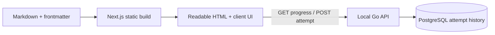

# Interview Atlas

A personal interview study library and an explainable portfolio project. The first
working slice uses **Next.js + strict TypeScript**, a **Go HTTP API**, and
**PostgreSQL**. Study material lives in Markdown and stays readable when progress
services are unavailable.

## Run locally

Prerequisites: Node.js 26, Go 1.27, Docker with Compose, and Make. Tested locally with
Go 1.27.1. The app and database bind to loopback; this is a single-user local setup.

```sh
npm ci
cp .env.example .env
make db
make migrate
make api
```

In a second terminal:

```sh
make web
```

Open **http://127.0.0.1:3000**. The API is at **http://127.0.0.1:8088**, with database
readiness at `/healthz`. Port 8088 avoids another local service using 8080. PostgreSQL
uses port 54329 and a named Docker volume that preserves history across restarts.

Make supplies `DATABASE_URL` and `TEST_DATABASE_URL` from local defaults. Override
them in the shell for another database; Go does not load `.env` automatically.
Next.js reads the root `.env` file. For custom ports/origins, also export `API_ADDR`
and `ALLOWED_ORIGINS` when starting Go, and set `NEXT_PUBLIC_PROGRESS_API_URL` in
`.env`. Public frontend environment values are compiled into the build.

To stop, press Ctrl+C in each server terminal and run `docker compose stop postgres`.
Stopping the database preserves the volume. Never use a development database for
integration tests unless its user can create isolated test schemas; tests delete
only their own uniquely named `atlas_test_*` schemas.

## What works

- Search by title or tag, with accent-insensitive matching and section filters.
- Six concepts: Big O, hidden loops, collection selection, problem framing,
  Airflow STAR story, and an AI-generated code review checklist.
- English and Spanish interface, explanations, questions and answers. Both versions
  keep English interview phrasing and show unknown STAR metrics in amber.
- Eleven supplied practice questions with answer reveal and three self-grades:
  **Lo sabía / Knew it**, **Dudé / Hesitated**, and **No lo sabía / Did not know**.
- Saved attempt counts and the latest grade for each reviewed question.
- Responsive reading, keyboard controls, visible focus, and reduced-motion support.

The static source status (`learned`, `in-progress`, `pending`) describes existing
study material. It is separate from saved review grades and is never automatically
rewritten by an assessment. The STAR page has no grading controls because its seed
does not supply a drill answer.

## Language selection

Open `/es/` for Spanish or `/en/` for English. The sidebar selector keeps the current
concept when switching. A manually chosen language is remembered under
`interview-atlas.locale` in localStorage; storage restrictions do not prevent switching.
The unlocalized `/` and original `/concepts/<id>/` links use that preference, then
the first supported browser language (for example `es-PE` or `en-US`), then Spanish.
They also provide explicit ES/EN links when JavaScript is unavailable.

Direct localized links always select their own language. This uses browser language
preferences, not physical-country detection. The selector is disabled while any
review is saving or awaiting confirmation, preserving its retry identity. Existing
history uses the same concept/question IDs in both languages.

Markdown lives in parallel `content/es/` and `content/en/` trees. Interface messages
are typed dictionaries, with no added translation library. Build validation rejects
missing/extra translations, changed question identities, mismatched source status,
interview phrasing, or removed/altered placeholders. The Spanish STAR page is a
literal translation of the original English source; metrics remain unfilled.

## Architecture and failure behavior



The build never calls Go or PostgreSQL. `npm run build` produces `out/`, including
all concept pages. The frontend has no Next.js API routes or database credentials.

`POST /api/attempts` accepts `attemptId`, `conceptId`, `questionId`, and `grade`.
PostgreSQL owns the timestamp and the UUID primary key. Insert-first deduplication
returns **201** for a new attempt, **200** and the original record for an identical
retry, or **409** when the same ID carries a different payload.
`GET /api/progress` derives counts and latest grades by stable concept/question IDs.

The UI creates a UUID once per assessment and retains it for an explicit retry.
Alternative grades stay disabled until the pending review is resolved. Only a
matching successful response announces **Guardado / Saved**. A network/API failure shows
an unconfirmed save; reading and answer reveal keep working. Keep the page open to
retry that same attempt: pending requests are held in memory, with no durable
offline queue or automatic resends. Reloading discards a pending retry identity;
check the saved history before grading again after an uncertain outcome.
An ID conflict is permanent for that payload, so it offers no futile retry: reload
and inspect history before starting a new review.

The API validates bounded JSON, canonical UUIDs, slug IDs (up to 128 characters),
and grades; SQL is parameterized. It uses finite timeouts, exact local CORS origins,
and sanitized service errors. It intentionally has no authentication, and the
server refuses to bind outside loopback. **Publishing this repository does not
publish the progress service.** Hosted auth and deployment are later decisions.

Decisions and Diego's still-pending interview defenses:

- [Static content and Go progress](docs/adr/0009-static-content-and-go-progress.md)
- [PostgreSQL storage](docs/adr/0010-postgresql-for-study-attempts.md)
- [Attempt history and idempotency](docs/adr/0011-review-attempt-history.md)
- [Static bilingual pages](docs/adr/0012-static-bilingual-study-pages.md)
- [Approved first-slice design](docs/superpowers/specs/2026-10-04-first-study-slice-design.md)

## Verify

```sh
make db
make check
```

`make check` runs frontend tests, strict type checking, linting, Go unit tests,
real PostgreSQL integration tests with the race detector, and both builds. The
integration tests cover concurrent retries, conflict handling, persistence across
connections, CORS, input rejection, and database outages. GitHub Actions repeats
these checks against its own disposable PostgreSQL service. No deployment jobs run.

Tooling dependencies: gray-matter parses validated frontmatter; react-markdown
renders content without raw HTML; remark-gfm preserves the seed's tables. The
alternatives were a custom parser/renderer or MDX, which adds unnecessary execution
and authoring complexity here. pgx is the PostgreSQL driver instead of a separate
`database/sql` adapter. Vitest, TypeScript ESLint, and React hook rules supply local
checks. Next's full lint preset was replaced after its transitive dependency audit
reported an unpatched advisory; the production build still checks Next integration.

## Current scope and learning ownership

This is the first usable vertical slice, **not the completed Phase 1 roadmap**.
[SPEC.md](docs/SPEC.md) keeps the remaining work visible: more seed concepts,
visualizers, C# sample compilation tests, and the scheduled drill experience.
The referenced visualizer HTML source files were not included in this repository.

The spaced-repetition scheduler and later Domain/Application exercises are tagged
`[DIEGO]`. They remain unimplemented until Diego writes them and states their
time/space complexity. There are no due-date claims, box levels, weakest-concept
rankings, AWS scaffolds, or external AI review calls in this slice.

Stable IDs in frontmatter link material to history. Editing question wording keeps
the same identity; a different learning question needs a new ID. Build validation
rejects missing metadata and duplicate identities. Never invent experience metrics
or replace `[COMPLETAR: ...]`; preserve the original study wording.

## AI-assisted workflow

Diego chose the architecture and approved the design. Codex implemented the slice;
a read-only Claude session reviewed it. Its exposed-answer finding led to a
regression test and a structural correction that preserves the study wording.
[Review and verified resolutions](docs/reviews/2026-10-04-claude-first-slice.md)
record the evidence, trade-offs, and deferred summary refinement.

## What changed and why

Markdown becomes static HTML so interview reminders remain available during outages.
Go records immutable review attempts; PostgreSQL makes concurrent retries count once.
The client confirms saves explicitly and retains the original ID for manual retries.
This small slice proves the stack while leaving Diego's learning exercises under his ownership.
Language-specific static URLs make the chosen language shareable without API access.
Translation identity checks preserve the same review history across Spanish and English.
